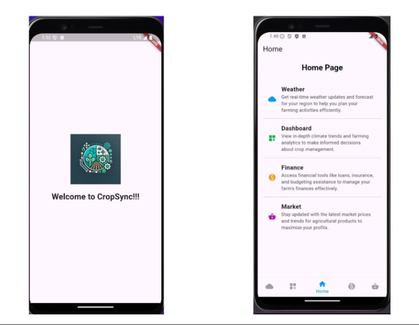
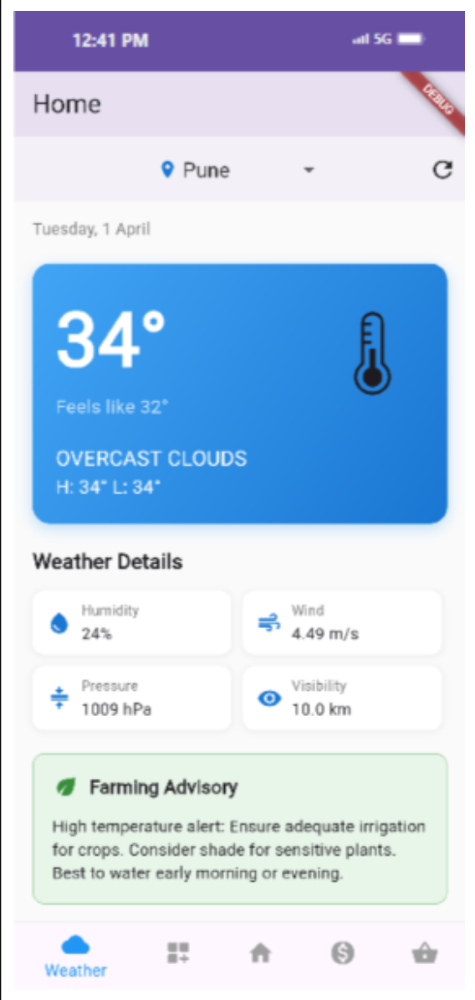
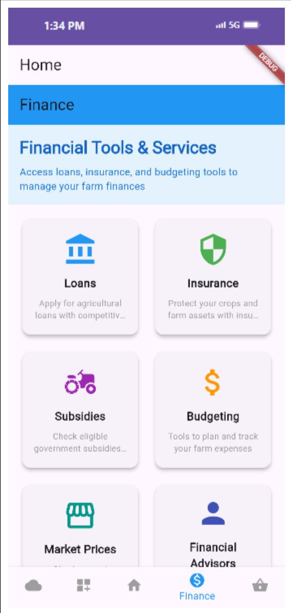
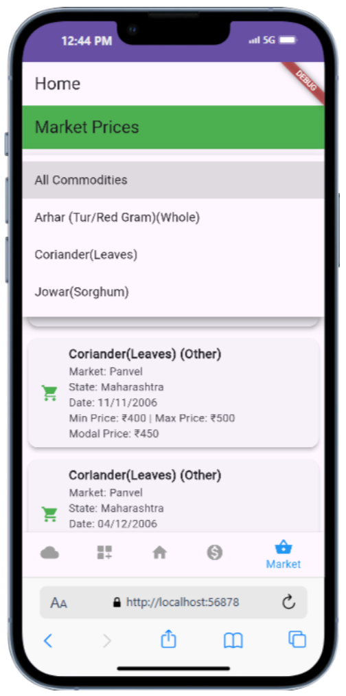

# 🌾 CropSync — Smart Farming System

A cross platform smart farming platform designed to help farmers make better agricultural decisions using real time weather data, financial tools, and market insights.

---
## 🏆 Research Publication

This project formed the basis of the research paper:

**CropSync: AI-Driven Blockchain Solution for Smart Farming**

Presented at the **14th International Conference on Recent Challenges in Engineering and Technology (ICRCET 2025)**.

The research explores how AI-driven analytics, blockchain-based traceability, and real-time agricultural data can improve transparency and decision-making across farming ecosystems.

📄 Read the full paper here:  
[Research Paper](https://drive.google.com/drive/folders/1X0oZZLyCRHZN24mBnEllNOWJfU4n7LwC?usp=drive_link)

## 📱 Application Overview

CropSync provides farmers with a single platform to access critical agricultural information including:

• Real time weather updates  
• Crop advisory recommendations  
• Market price monitoring  
• Financial tools and services  
• Agricultural dashboards  

The system is designed to improve decision making, increase productivity, and simplify farm management.

---

# 🚀 Features

## 🌤 Weather Intelligence
Real time weather updates help farmers plan irrigation, harvesting, and crop protection.

Features include:

• Temperature and forecast monitoring  
• Humidity and wind insights  
• Pressure and visibility metrics  
• Smart farming advisory suggestions  

---

## 📊 Dashboard Analytics
Provides a visual overview of important farming metrics and system insights.

• Agricultural data monitoring  
• Farming analytics visualization  
• Decision support insights  

---

## 💰 Financial Tools
Helps farmers manage finances and access important services.

• Agricultural loans  
• Crop insurance  
• Budgeting tools  
• Government subsidies  

---

## 📈 Market Price Tracking
Allows farmers to track commodity prices in different markets.

• Commodity selection  
• Market wise pricing  
• Minimum, maximum, and modal prices  

---
# 🖼 Application Screenshots

| Home | Weather | Finance | Market |
|-----|-----|-----|-----|
|  |  |  |  |

# 🛠 Tech Stack

### Frontend

---

### Backend

---

### Database

---

### APIs

---
